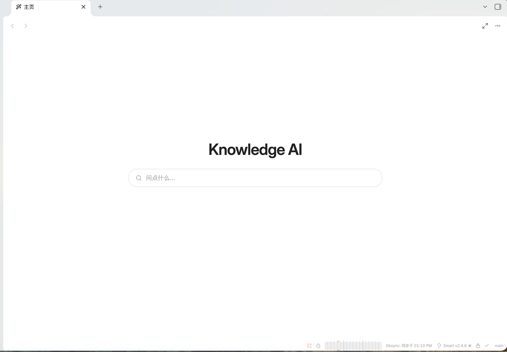
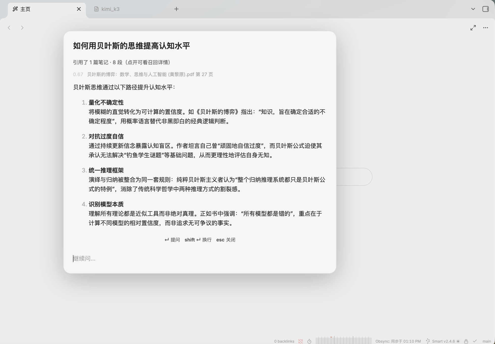
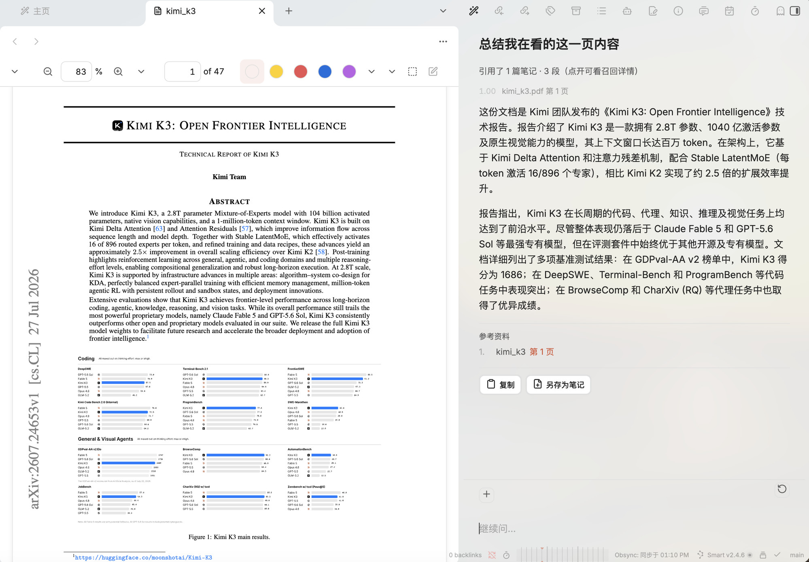

[English](README.en.md) · **简体中文**

# Knowledge AI 

本地的飞书/Lark知识问答，完全免费，无限用量，全本地部署。用自然语言问你的 Obsidian 库。语义检索覆盖笔记和 PDF，回答附带可点击的出处，**全部在本机运行**——没有任何数据离开你的电脑。
> 想要的是这种体验：按一下快捷键，弹出一个搜索框，直接问「我记过哪些关于 XXX 的方法」，
> 而不是打开右侧栏、再手动指定要读哪个文件。

---

## 截图

**主页** —— 接管新标签页，一个居中的搜索框，点一下或直接打字就开始问。



**提问** —— 快捷键唤起居中弹窗，答案流式输出，末尾附可点击的出处。



**边看边问** —— 右侧面板常驻。问「总结我在看的这一页」时自动只读 PDF 当前翻到的那一页，引用可以点回原页。



---

## 目录

- [它能做什么](#它能做什么)
- [安装](#安装)
  - [1. Obsidian](#1-obsidian)
  - [2. Ollama](#2-ollama)
  - [3. 下载模型](#3-下载模型)
  - [4. 安装插件](#4-安装插件)
  - [5. 首次配置](#5-首次配置)
- [建立索引](#建立索引)
- [使用](#使用)
- [设置项详解](#设置项详解)
- [常见问题](#常见问题)
- [隐私与网络](#隐私与网络)
- [和同类方案的对比](#和同类方案的对比)

---

## 它能做什么

**问答**
- 语义检索 + 关键词检索混合，覆盖 Markdown 笔记和 PDF
- 回答末尾附参考资料，点击直接跳到对应笔记的行或 PDF 的页
- 追问时自动把「那第二点展开说说」改写成可检索的独立问题
- 支持贴图提问（截图 `Cmd+V` 直接粘进去）

**三个入口，一套对话**
- 居中弹窗（主入口，快问快答）
- 右侧面板（常驻，边看笔记边追问）
- 中间面板（长对话读起来舒服）

对话可以在三者之间搬运，也可以接管新标签页显示成一个主页。

**理解你在看什么**
- 问「这篇论文讲了什么」→ 自动限定到当前打开的文件
- 问「这页讲了什么」→ 自动限定到 PDF 当前翻到的那一页
- 问「上周记了什么」→ 按文件修改时间筛选
- 也可以手动点 `+` 指定要在哪几个文件里找

**改写**
- 选中一段 → 右键「改写选中内容」→ 六个预置指令或自己写
- 生成后显示行级 diff，确认无误才写回笔记

**索引**
- 增量更新：只处理改动过的文件
- 自动监听：库内文件增删改后自动更新（可关）
- PDF 文字提取带缓存，重建索引不会重来
- 可选：给图片生成文字描述，让图片本身能被搜到

---

## 安装

> **赶时间？** 如果你在用 Claude Code、Codex 这类命令行 AI，
> 可以直接把这份 README 丢给它，让它照着装——见下方[方式三](#方式三把这份-readme-丢给-ai-agent)。

### 1. Obsidian

从 [obsidian.md](https://obsidian.md) 下载安装。需要 **1.5.0 或更高**版本。

本插件是 `isDesktopOnly`，**只支持桌面端**（macOS / Windows / Linux），手机端用不了。

### 2. Ollama

Ollama 负责在本机跑模型。从 [ollama.com/download](https://ollama.com/download) 下载安装。

安装后它会作为后台服务运行，默认监听 `http://localhost:11434`。验证一下：

```bash
ollama --version
```

### 3. 下载模型

需要两类模型：**嵌入模型**（建索引用，必装）和**对话模型**（回答问题用）。

#### 嵌入模型（必装）

```bash
ollama pull bge-m3
```

[bge-m3](https://ollama.com/library/bge-m3) · 约 1.2 GB · 1024 维 · 多语言

**如果你的库里有中文、日文或其他非英语内容，请务必用这个。** 它是目前本地能跑的多语言嵌入模型里质量最好的。纯英文库可以换更小的 `nomic-embed-text`（274 MB），但换模型会让已有向量全部失效、必须重建索引。

#### 对话模型

**Apple Silicon（M 系列芯片）用户看这里。** Ollama 为这几个模型提供了 `-mlx` 变体，
用 Apple 原生的 MLX 后端。实测同尺寸下比 GGUF 快约 1.5 倍，依据度也更好，
**有 MLX 版就优先用 MLX 版**。

| 模型 | 大小 | 解码速度* | 适合 |
|---|---|---|---|
| [`qwen3.5:4b-mlx`](https://ollama.com/library/qwen3.5:4b-mlx) | 4.0 GB | ~62 tok/s | 内存紧张，或想要秒回 |
| [`qwen3.5:9b-mlx`](https://ollama.com/library/qwen3.5:9b-mlx) | 8.9 GB | ~38 tok/s | **推荐**，质量与速度平衡 |
| [`gemma4:e4b-mlx`](https://ollama.com/library/gemma4:e4b-mlx) | 8.8 GB | — | 另一种风格，可对比着试 |

<sub>* 在 M4 Pro（14 核 CPU / 20 核 GPU / 24 GB 统一内存）上实测，仅供相对参考。</sub>

```bash
# 推荐：先装这个
ollama pull qwen3.5:9b-mlx

# 机器吃紧就用 4b
ollama pull qwen3.5:4b-mlx

# 想对比另一种风格
ollama pull gemma4:e4b-mlx
```

**Intel Mac / Windows / Linux 用户**：MLX 是 Apple 专有的，你们用不了，
去掉 `-mlx` 后缀即可，其余完全一样：

```bash
ollama pull qwen3.5:9b
```

各尺寸和量化版本见 [qwen3.5 全部标签](https://ollama.com/library/qwen3.5/tags) ·
[gemma4 全部标签](https://ollama.com/library/gemma4/tags)。

> **参数量和量化，哪个更影响速度？** 实测结论是**量化影响更大**。
> 同样 9B，4bit 比 8bit 快 1.5 倍；而 4B 换到 9B 只慢 1.65 倍（不是参数比的 2.25 倍）。
> 内存够的话，优先选大模型的低比特量化，而不是小模型的高比特量化。

#### 视觉模型（可选，想贴图提问才需要）

如果你要贴截图提问，需要一个能看图的模型。**注意：Ollama 的 MLX 后端目前收不到图片**——模型只会拿到一个占位符，然后一本正经地说"我看不到图片"。所以视觉模型必须用 GGUF 版本（就是不带 `-mlx` 后缀的那些）。

```bash
ollama pull gemma4:e4b
```

插件的设置页里「视觉模型」是**单独一项**，可以和对话模型配不同的：文字质量和看图能力目前很难兼得。配好后一定要点旁边的「测试」实际验证——模型的能力标签不可信。

### 4. 安装插件

**方式一：BRAT（推荐，能自动更新）**

1. 在 Obsidian 里安装社区插件 **BRAT**（Beta Reviewers Auto-update Tool）
2. 打开 BRAT 设置 → `Add Beta Plugin`
3. 填入 `iamtheozzz/obsidian-knowledge-ai`
4. 完成，之后有新版本会自动提示更新

**方式二：手动安装**

1. 到 [Releases](https://github.com/iamtheozzz/obsidian-knowledge-ai/releases) 页下载最新版的三个文件：
   `main.js`、`manifest.json`、`styles.css`
2. 在你的库里新建目录：`<你的库>/.obsidian/plugins/knowledge-ai/`
3. 把三个文件放进去
4. 重启 Obsidian，在「设置 → 第三方插件」里启用 **Knowledge AI**

> `.obsidian` 是隐藏目录。macOS 上在 Finder 里按 `Cmd+Shift+.` 显示隐藏文件。

**方式三：把这份 README 丢给 AI agent**

如果你在用 Claude Code、Codex 或类似的命令行 AI，可以直接对它说：

> 照着这份 README 帮我把 Knowledge AI 装好（附上本文件）

前面的步骤（装 Obsidian、装 Ollama、拉模型、放插件文件、写配置）它都能代劳。
下面是等价的命令，你也可以自己执行：

```bash
# 1. Obsidian 和 Ollama
brew install --cask obsidian
brew install ollama
ollama serve &                       # macOS 装完要先把服务跑起来

# 2. 模型（嵌入必装，对话按内存二选一）
ollama pull bge-m3
ollama pull qwen3.5:9b-mlx           # 内存 ≥ 16 GB
# ollama pull qwen3.5:4b-mlx         # 内存 < 16 GB 用这个
#   非 Apple Silicon 去掉 -mlx 后缀

# 3. 插件文件（把 VAULT 换成你的库路径）
VAULT="$HOME/Documents/MyVault"
DIR="$VAULT/.obsidian/plugins/knowledge-ai"
mkdir -p "$DIR"
# 从 https://github.com/iamtheozzz/obsidian-knowledge-ai/releases/latest
# 下载 main.js / manifest.json / styles.css 到 $DIR

# 4. 最小配置（其余全部走默认值）
cat > "$DIR/data.json" <<'JSON'
{ "chatModel": "qwen3.5:9b-mlx" }
JSON
```

**agent 做不了的最后一步**：打开 Obsidian →「设置 → 第三方插件」→ 启用 **Knowledge AI**。
Obsidian 没有提供命令行开关，这一下必须你自己点。

启用之后**不用手动建索引**——`autoIndex` 默认开着，
库里任何文件有变动，15 秒后就会自动开始建。想立刻开始就去设置页点「开始建立索引」。

> **配置为什么只写一行？** 插件的设置是 `默认值 + data.json` 合并出来的，
> 所以只需要写你要改的项。端点（`localhost:11434/v1`）、嵌入模型（`bge-m3`）、
> 自动索引这些默认值都是对的，不用重复写。

#### 内存对照

对话模型的选择主要看内存，不是看 CPU：

| 内存 | 建议 |
|---|---|
| 8 GB | 只能用 `qwen3.5:4b-mlx`，并在设置里关掉「索引 PDF」 |
| 16 GB | `4b` 舒服，`9b` 勉强（同时开别的应用会吃紧） |
| 24 GB 以上 | `9b` 舒服 |

9B 模型加上上下文缓存实测要占 10 GB 以上。内存不够时系统会开始交换，
表现是「能跑但极慢」，而不是报错——所以别硬上。

### 5. 首次配置

打开「设置 → Knowledge AI」：

1. **端点 URL** —— 保持默认 `http://localhost:11434/v1`
2. **对话模型** —— 下拉框会自动列出你已安装的模型，选一个
3. 点旁边的 **测试** —— 应该显示连接成功、首字延迟和生成速度
4. **嵌入模型** —— 默认 `bge-m3`，点「测试」确认可用

四步都通过就可以建索引了。

---

## 建立索引

插件要先把你的库变成可检索的向量索引，才能回答问题。

### 第一次建索引

设置页 → 「索引状态」→ 点 **开始建立索引**。

状态栏会显示进度（`索引中 42/318`）。这个过程可以放着不管，Obsidian 照常用。

**要多久？** 取决于库的大小。参考量级：

| 库规模 | 大致耗时 |
|---|---|
| 几百篇笔记，无 PDF | 1–3 分钟 |
| 加上几十个 PDF | 10–20 分钟 |
| 上百个 PDF（含大部头教材） | 30 分钟以上 |

PDF 是主要开销——一本几百页的书会切成上千个片段。设置里可以先关掉「索引 PDF」，只索引笔记，跑通了再打开。

### 之后

**默认自动增量更新。** 你改了、加了、删了文件，插件会在 15 秒防抖后自动更新索引，只处理变动过的文件——没变的一个都不重跑。

如果你关掉了「自动索引」，就回设置页手动点「更新索引」。

### 什么时候需要重建

只有两种情况：

- **换了嵌入模型** —— 不同模型的向量不可比，必须全部重算
- **怀疑索引损坏** —— 检索结果明显不对劲

设置里的「重建」按钮会清空后全量重跑。**PDF 的文字提取有缓存，重建时不会重新解析 PDF**，所以比第一次快得多。

---

## 使用

### 提问

| 操作 | 效果 |
|---|---|
| `Cmd/Ctrl + Shift + K` | 唤起居中弹窗 |
| 点左侧栏的图标 | 同上 |
| 命令面板 → `Knowledge AI: 提问` | 同上 |

输入问题，回车。答案流式输出，末尾附参考资料。

`Enter` 提问 · `Shift + Enter` 换行 · `Esc` 中止生成（再按一次关窗）

### 限定检索范围

插件会自动识别这几类问法：

| 你问 | 它做什么 |
|---|---|
| 「**这篇**论文讲了什么」 | 只在当前打开的文件里找 |
| 「**这页**主要内容是什么」 | 只读 PDF 当前翻到的那一页 |
| 「**上周**记了什么」 | 只找最近两周修改过的文件 |
| 「最近三个月读了什么」 | 按时间过滤，支持中文数字 |

也可以手动指定：在右侧/中间面板的输入框上方点 **`+`**，选一个或多个文件，之后所有提问都只在这些文件里找。文件列表按最近打开排序。

### 面板

- 命令面板 → `在右侧面板中打开` / `在中间面板中打开`
- 答案下方的 **「在面板中打开」** 可以把当前对话整体搬过去
- 面板标题栏的图标可以在右侧和中间之间来回移动
- 输入框旁的 **↺** 清空对话开始新一轮（已选的文件范围会保留）

对话会随 Obsidian 的工作区一起保存，折叠侧栏、重启软件都不会丢。

### 改写笔记

选中一段文字，然后：

- 右键 → **改写选中内容**，或
- 命令面板 → `Knowledge AI: 改写选中内容`

六个预置指令（更简洁 / 更清楚 / 更正式 / 提炼要点 / 展开说明 / 译成英文），也可以自己写指令。

生成后会显示**行级 diff**——红色删除线是原文，绿色是新内容。确认无误再点「替换选中内容」，**不确认不会动你的笔记**。

### 贴图提问

- 截图后在输入框里 `Cmd/Ctrl + V`
- 或把图片文件拖进弹窗
- 或点当前笔记里的图片缩略图

图片会自动缩到长边 1024 再发送——视觉模型按图块计费，Retina 截图不缩的话一张就能占满上下文。

### 主页

命令面板 → `打开主页`，或在设置里打开「用主页接管新标签页」。

主页是一个居中的搜索框，点一下（或直接打字）就唤起提问弹窗。标题栏有个按钮可以切换「简洁模式」，只留标题和搜索框。

> 如果你装了 Beautitab、Home tab 这类也接管新标签页的插件，两边会抢同一个空标签页，**只能开一个**。

---

## 设置项详解

### 模型

| 项 | 说明 |
|---|---|
| **端点 URL** | 任意 OpenAI 兼容端点。Ollama 默认 `http://localhost:11434/v1` |
| **对话模型** | 下拉框自动列出端点上可用的模型 |
| **视觉模型** | 提问带图片时改用它；留空则沿用对话模型 |
| **API Key** | 只有用云端点时才需要，本地 Ollama 留空 |

### 语言

| 项 | 说明 |
|---|---|
| **界面语言** | 默认跟随 Obsidian 的设置，可强制中文或英文 |
| **回答语言** | 默认跟随你提问时用的语言 |

### 索引

| 项 | 默认 | 说明 |
|---|---|---|
| **内部知识检索** | 开 | 开：严格依据笔记作答并附引用。关：笔记只作参考，模型可自由发挥 |
| **索引范围** | 全库 | 可以只索引指定的几个文件夹 |
| **索引 PDF** | 开 | PDF 会显著增加首次索引时间 |
| **索引图片内容** | 关 | 用视觉模型给每张图生成描述。一张十几秒，开之前先测试视觉模型 |
| **嵌入模型** | `bge-m3` | ⚠️ 换模型会让已有向量全部失效，必须重建索引 |
| **嵌入端点** | 跟随主端点 | 对话用云端、嵌入用本地时在这里单独填 |
| **存储位置** | 库之外 | 默认放在系统应用数据目录，避免被 Obsidian Sync 同步走 |
| **自动索引** | 开 | 文件变动后自动增量更新（15 秒防抖） |

### 高级

| 项 | 默认 | 说明 |
|---|---|---|
| **召回段数** | 8 | 每次提问最多取几段材料。调大会明显吃上下文和时间 |
| **相似度阈值** | 0.5 | 低于这个分数的段落直接丢弃 |

> **关于阈值**：0.5 是实测的分界——真正相关的段落通常在 0.60 以上，
> 完全无关的内容也能拿到 0.35–0.49。调到 0.3 会把无关材料一起塞给模型。
>
> 但有一个例外：**跨语言检索的分数系统性偏低**。中文提问命中法语原文时
> 可能只有 0.50 出头。如果你的库里有外语原版书且搜不到，试试把阈值调到 0.45。

### 界面

| 项 | 默认 | 说明 |
|---|---|---|
| **显示侧边栏图标** | 开 | 左侧栏的唤起图标 |
| **用主页接管新标签页** | 关 | 和 Beautitab 这类插件冲突，只能开一个 |

---

## 常见问题

**问：点「测试」显示连不上**

确认 Ollama 在运行：终端执行 `ollama list` 能列出模型就是正常的。macOS 上 Ollama 装完需要手动启动一次（在应用程序里打开）。

**问：回答说「库里没有找到相关内容」，但我确定有**

三种可能：

1. **索引还没跑完或没建** —— 看设置页的「索引状态」
2. **相似度不够** —— 试试把问题说得更接近笔记里的原话，或调低阈值
3. **文件类型不支持** —— 目前只索引 `.md` 和 `.pdf`

**问：PDF 提取不出文字**

扫描版 PDF（本质是图片）需要 OCR，本插件不支持。设置页的「测试」按钮会告诉你具体是哪个文件、什么原因。

**问：回答很慢**

首字延迟主要花在两处：检索（1–2 秒）和模型 prefill（材料越多越慢）。可以：

- 换更小的模型（`qwen3.5:4b` 比 `9b` 快 1.6 倍）
- Apple Silicon 上优先用 `-mlx` 变体（比同尺寸 GGUF 快 1.5 倍）
- 调小「召回段数」

**问：报错「上下文窗口只有 4096 token」**

从 HuggingFace 直接拉的 GGUF 模型在 Ollama 上默认只给 4096 的窗口。插件会自动识别并重试，但如果反复出现，建议换用 Ollama 官方库里的模型。

**问：图片提问时模型说「我看不到图片」**

Ollama 的 MLX 后端目前不支持图片输入。在设置里把「视觉模型」单独配成一个 GGUF 模型（不带 `-mlx` 后缀），然后点「测试」验证。

**问：索引占多大空间？**

大致按「每 1000 个片段 4 MB」估算。索引默认存在库之外的系统应用数据目录，不会被 Obsidian Sync 或 git 同步走。设置里可以改位置。

---

## 隐私与网络

**所有数据都留在本机。**

插件只会向你在设置里填的那个端点发请求。默认配置下就是 `http://localhost:11434`——你自己电脑上的 Ollama。笔记内容、PDF 文字、提问和回答都不会离开这台机器。

如果你把端点改成云服务商的地址，那笔记内容就会发到那个服务商——这是你的选择，插件不做任何隐藏的请求。

**关于本地文件访问**：插件读取库内文件用的是 Obsidian 的 Vault API。索引文件默认写在库之外（系统应用数据目录），这是刻意的——索引是本机计算产物，几十 MB，放进库里会被 Obsidian Sync 和 git 一起同步走。这部分读写用 Node 的 `fs`，所以插件标记为 `isDesktopOnly`。

**关于流式输出**：模型回答是流式返回的，用的是 Node 的 `http`（Obsidian 的 `requestUrl` 不支持流式，而 `fetch` 在渲染进程里受 CORS 限制）。请求只发往你配置的端点。

---

## 和同类方案的对比

| | **本插件** | **飞书知识问答** | **Copilot for Obsidian** | **Claudian** | **Claude Code / Codex** |
|---|---|---|---|---|---|
| 形态 | Obsidian 插件 | 云服务 | Obsidian 插件 | Obsidian 插件 | 终端 CLI |
| **唤起方式** | ✅ 居中搜索框 | ✅ 居中搜索框 | ❌ 只有侧栏 | ❌ 只有侧栏 | 终端 |
| **数据私有化** | ✅ 全本机 | ❌ 上云 | ⚠️ 取决于配置 | ❌ 上云 | ❌ 上云 |
| **模型灵活度** | ✅ 任意 OpenAI 兼容端点 | ❌ 固定 | ✅ 多家 + 本地 | ⚠️ 限编程 agent | ⚠️ 各自绑定 |
| **可训练性** | ✅ 换成自己微调的模型即可 | ❌ | ✅ 同左 | ❌ | ❌ |
| **文件实时修改** | ⚠️ 改写需确认 | ❌ 只读 | ⚠️ 部分 | ✅ 全自动 agent | ✅ 全自动 agent |
| **检索方式** | 语义 + 关键词混合 | 语义（云端） | 语义 + 关键词混合 | 无向量索引，靠 grep/读文件 | 同左 |
| **引用溯源** | ✅ 点击跳到行/页 | ✅ | ✅ | ⚠️ 靠模型自述 | ⚠️ 靠模型自述 |
| **离线可用** | ✅ | ❌ | ⚠️ 配本地模型才行 | ❌ | ❌ |
| **持续成本** | 0 | 订阅 | 0 或 API 费 | API 费 | API 费 |

### 逐个维度说明

**唤起方式**

这是本插件最初被做出来的原因。

飞书知识问答的入口是一个**醒目的搜索框**——想问就问，不用先想清楚该读哪个文件。
本插件把这个体验搬进了 Obsidian：一个快捷键，弹出居中搜索框，输入问题就完了，
和按 `Cmd+O` 打开 Quick Switcher 是同一种手感。

Obsidian 的 AI 插件基本都是**侧栏形态**：点开右侧面板、在里面聊天，
往往还要手动指定「读哪几个文件」。查过代码确认：Copilot（3.3.3）和 Claudian（2.0.41）
都只注册了侧栏视图，没有任何居中弹窗类的入口。

侧栏适合长对话，但不适合「随手问一句」——你得先腾出屏幕空间，才能开始想问题。
本插件三种形态都有（弹窗 / 右侧 / 中间），但**默认且主推的是弹窗**。

**数据私有化**

本插件默认只往 `localhost` 发请求，笔记内容、PDF 文字、提问和回答都不出本机。飞书、Claudian、Claude Code / Codex 都必须把内容发给云端模型才能工作——这不是缺陷，是形态决定的。

Copilot for Obsidian 打了 ⚠️ 是因为它**两种都支持**：配 OpenAI/Anthropic 就是上云，配本地 Ollama 就是全本机。选择权在你。

**模型灵活度**

本插件对接的是「任意 OpenAI 兼容端点」，所以本地 Ollama、`mlx_lm.server`、自建推理服务、云端 API 都能接。Copilot 同样开放。

飞书用的是自家模型，用户没有选择。Claude Code 和 Codex 各自绑定 Anthropic 和 OpenAI；Claudian 是这两者的壳，所以继承同样的限制。

**可训练性**

严格说，这几个产品**都不能在产品内训练模型**。但区别在于：**能不能把你自己训好的模型接进来。**

本插件和 Copilot 可以——你用 LoRA 微调一个 4B 模型、跑起来暴露成 OpenAI 兼容端点，填进设置就能用。云端产品做不到这件事。

**文件实时修改**

差异最大的一项，也最需要想清楚你要什么。

- **Claude Code / Codex / Claudian** 是 agent：自己决定读哪个文件、改哪一行、直接落盘。能力最强，代价是你得盯着它，改错了要靠 git 回滚。
- **本插件**刻意做成半自动：只改**你选中的那段**，生成后显示行级 diff，**不确认不写盘**。改动范围可控，出错代价就是点一下取消。
- **飞书知识问答**是纯只读的问答。

这是个取舍，不是优劣：想让 AI 帮你重构一整个目录的笔记，本插件做不到；想安全地润色一段话，agent 那套反而过重。

**检索方式**

本插件、飞书、Copilot 都建向量索引。本插件和 Copilot 还都做了**混合检索**——
在语义检索之外并行跑一路关键词检索再融合。

这一路是必要的：语义检索对罕见专有名词（缩写、型号、人名）是盲区，
问「什么是 XXX」时可能直接回答「库里没有」，而实际上有好几段。
这类**错误的否定回答**比答得不好危险，因为用户无从察觉。

Claude Code / Codex / Claudian **不建索引**，靠 agent 自己 grep 和读文件。好处是不需要预处理、永远是最新的；坏处是「我记过哪些关于专注的方法」这类概念性问题很难命中——笔记里写的可能是「先做五分钟」，字面上没有「专注」两个字。

**引用溯源**

本插件的参考资料由程序按实际用到的材料生成，不是让模型自己写——实测让模型写来源三次里漏两次，还会编造。点击可以直接跳到笔记的对应行或 PDF 的对应页。

agent 类工具的出处是模型在回答里自述的，准确性取决于模型。

### 该选哪个

| 你的情况 | 建议 |
|---|---|
| 资料敏感，不能上云 | **本插件**或 Copilot 配本地模型 |
| 想让 AI 大规模重构笔记 | Claudian / Claude Code |
| 团队协作，不想折腾配置 | 飞书这类云服务 |
| 想要功能最全的 Obsidian AI 插件 | Copilot（本插件功能面窄，专注问答+引用） |
| 有自己微调的模型想用上 | **本插件**或 Copilot |
| 就想按个快捷键快速问一句 | **本插件** |

> 说明：飞书知识问答的具体行为可能随版本和部署方式变化，上表基于其公开形态；
> Copilot 和 Claudian 的信息来自本文撰写时的版本（Copilot 3.3.3 / Claudian 2.0.41）。
> 各家都在快速迭代，以实际使用为准。

---

## 许可

MIT
